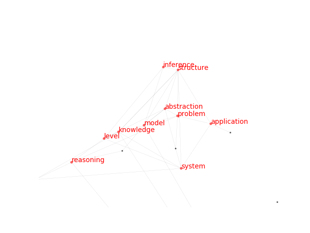

# RaKUn algorithm


This is the official repository of RaKUn. This keyword detection algorithm exploits graph-based language representations for efficient denoising and keyword detection.
Key ideas of RaKUn:
1. Transform texts to graphs
2. Prune graphs based on token similarity (meta vertex introduction)
3. Rank nodes -> keywords

[paper] (https://arxiv.org/abs/1907.06458)

## The core functionality
Packed as a Python library, it can be installed via:

```
pip3 install mrakun
```

or

```
python3 setup.py install
```

## Requirements
To install the required libraries, we suggest:
```
pip3 install -r requirements.txt
```
For visualization, one also needs Py3plex library (>=0.66). (pip3 install py3plex)

## Tests
To test whether the core functionality is ok, you can run
```
python3 -m pytest tests/test_core_functionality.py
```

## Usage with editdistance
Using RaKUn is simple! Simply call the main detector method with optional arguments (as described in the paper)

```python
from mrakun import RakunDetector
from nltk.stem import WordNetLemmatizer
from nltk.corpus import stopwords

hyperparameters = {"distance_threshold":3,
                   "num_keywords" : 10,
                   "pair_diff_length":2,
                   "stopwords" : stopwords.words('english'),
                   "bigram_count_threshold":2,
                   "lemmatizer" : WordNetLemmatizer(),
                   "num_tokens":[1]}

keyword_detector = RakunDetector(hyperparameters)
example_data = "./datasets/wiki20/docsutf8/7183.txt"
keywords = keyword_detector.find_keywords(example_data)
print(keywords)

keyword_detector.verbose = False
## do five fold CV on a given corpus (results for each fold need to be aggregated!)
keyword_detector.validate_on_corpus("./datasets/Schutz2008")
```
Two results are returned. First one are keywords with corresponding centrality scores, e.g.,

```
[('system', 0.07816398111051845), ('knowledg', 0.07806649568191038), ('structur', 0.05978269674796454), ('diagnost', 0.041354892225684135), ('problem', 0.04052608382511414), ('domain', 0.031261954442705624), ('intellig', 0.030126748143180067), ('medic', 0.026760043407613995), ('caus', 0.02639800122506548), ('method', 0.026292347276388087)]
```

And the plot of the keyword graph:

```python
## once the find_keywords() was invoked
keyword_detector.visualize_network()
```


## Usage with fasttext
Using RaKUn with fasttext requires pretrained emmbeding model. Download .bin file from https://github.com/facebookresearch/fastText/blob/master/docs/pretrained-vectors.md for chosen language and save it.

```python
from mrakun import RakunDetector
from nltk.stem import WordNetLemmatizer
from nltk.corpus import stopwords

hyperparameters = {"distance_threshold":0.2,
                   "distance_method": "fasttext",
                   "pretrained_embedding_path": '../pretrained_models/fasttext/wiki.en.bin', #change path accordingly
                   "num_keywords" : 10,
                   "pair_diff_length":2,
                   "stopwords" : stopwords.words('english'),
                   "bigram_count_threshold":2,
                   "lemmatizer" : WordNetLemmatizer(),
                   "num_tokens":[1]}

keyword_detector = RakunDetector(hyperparameters)
example_data = "./datasets/wiki20/docsutf8/7183.txt"
keywords = keyword_detector.find_keywords(example_data)
print(keywords)

keyword_detector.verbose = False
## do five fold CV on a given corpus (results for each fold need to be aggregated!)
keyword_detector.validate_on_corpus("./datasets/Schutz2008")
```
Two results are returned. First one are keywords with corresponding centrality scores, e.g.,

```
[('challeng', 0.0020178656087032464), ('structur', 0.0004547496070065125), ('medic', 0.00036679392170072613), ('incorpor', 0.0003508246625246401), ('experienc', 0.0003218803802679841), ('achiev', 0.00028520098809791154), ('knowledg', 0.000272475484691968), ('generat', 0.0002607480599845298), ('infer', 0.0002216982309055069), ('captur', 0.00012725503405943558)]
```

And the plot of the keyword graph:

```python
## once the find_keywords() was invoked
keyword_detector.visualize_network()
```




## Acknowledgements
The logo was created by Luka Skrlj

# Citation
If you use this, please cite:
(Accepted at SLSP2019)
TBA
